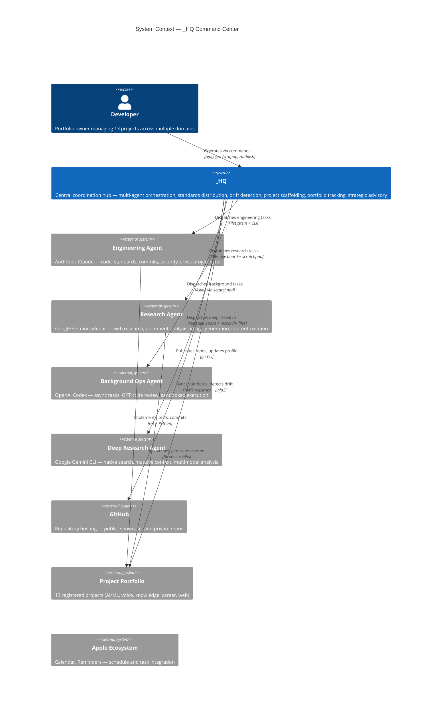
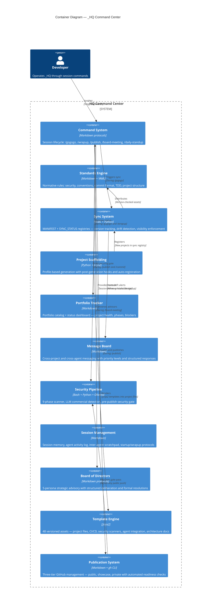
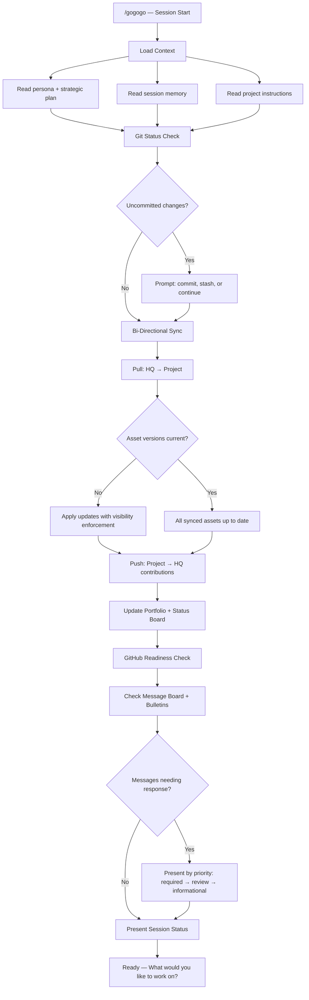
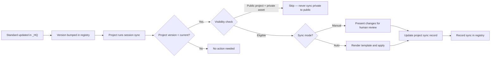
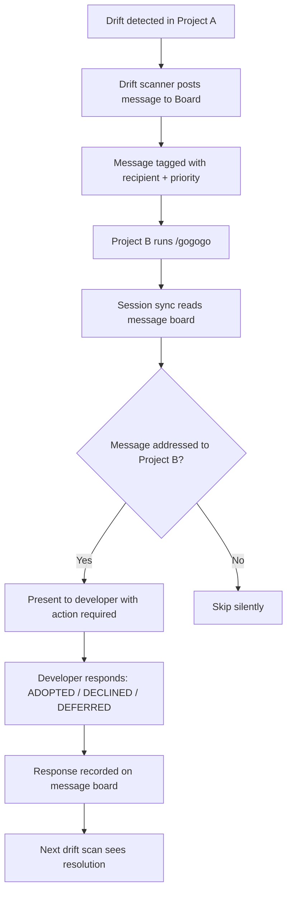
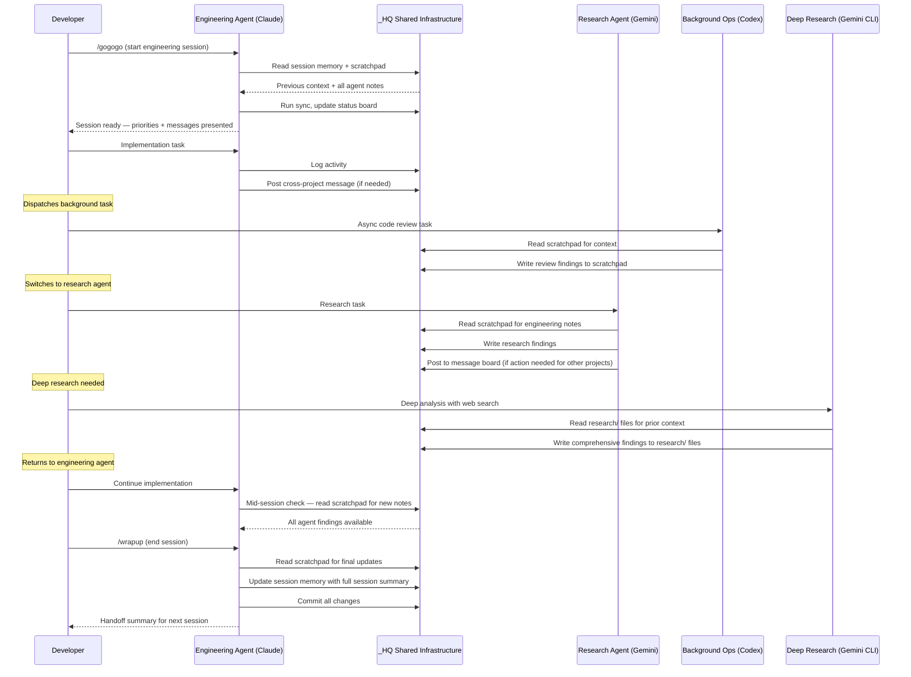
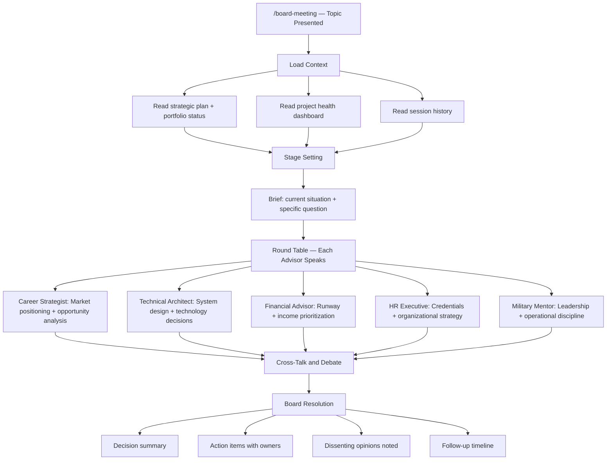

# System Architecture

> Technical architecture documentation for _HQ — AI-Augmented Project Command Center.
> Follows the [C4 Model](https://c4model.com/) with Mermaid.js diagrams.

---

## 1. System Context (C4 Level 1)

How _HQ fits into the broader development ecosystem, coordinating across projects and AI agents on different platforms.

---

## 2. Container Architecture (C4 Level 2)

The logical containers that compose _HQ. Each container is a functional subsystem implemented as files and scripts — no servers, no databases.

---

## 3. Key Design Decisions

| Decision | Choice | Why | Alternatives Considered |
|----------|--------|-----|------------------------|
| Data storage | YAML registries + Markdown | Zero dependencies, human-readable, git-friendly, editable by AI agents | SQLite (overhead for file-based coordination), JSON (less readable) |
| Template engine | Jinja2 | Industry standard, supports conditionals and loops, Python-native | Cookiecutter (too opinionated), Copier (extra dependency), string formatting (insufficient) |
| Multi-platform agent coordination | Convention-based (shared files) | No agent has real-time file detection; polling conventions are reliable across all platforms | WebSocket notifications (over-engineered), database locks (wrong abstraction), single-platform (limits capability) |
| Standards enforcement | Version-tracked sync with drift detection | Projects evolve independently; central enforcement would be brittle | Git submodules (merge conflicts), monorepo (projects are independent), copy-paste (no tracking) |
| Security scanning | Multi-phase Bash + Python + local LLM | Catches secrets, PII, private paths, commercial markers in one pass before any publish | Pre-commit hooks only (misses non-git content), commercial tools (cost, vendor lock-in) |
| Advisory system | Multi-persona simulation with deliberation protocol | Strategic decisions benefit from multiple perspectives; no scheduling overhead | Actual advisory board (premature at current scale), single-perspective analysis (blind spots) |
| GitHub publication | Three-tier model (Public/Showcase/Private) | Maximizes portfolio visibility while protecting commercial IP | All-public (IP risk), all-private (no visibility), per-file access control (not supported) |
| Agent platform selection | Claude (engineering) + Codex (background ops) + Gemini (research x2) | Each platform has distinct strengths; three-platform approach maximizes capability coverage while convention-based coordination manages complexity | Single platform (capability gaps), two platforms (misses async and deep research lanes) |

---

## 4. Data Flow — Session Lifecycle

The primary operational flow when a developer starts a work session. This runs every session across every project.

---

## 5. Data Flow — Standards Distribution

How engineering standards propagate from _HQ to all registered projects, with visibility enforcement preventing private asset leakage to public repositories.

---

## 6. Data Flow — Cross-Project Communication

How projects communicate through _HQ without requiring the developer to relay information.

---

## 7. Security Posture

| Concern | Approach |
|---------|----------|
| Secrets detection | 9-phase scanner checks for API keys, tokens, passwords, .env files, and private key patterns |
| PII protection | Scanner detects names, emails, phone numbers, addresses; three-layer PII detection guide for projects |
| Private content isolation | Visibility enforcement in sync system — private assets never sync to public projects |
| Commercial sensitivity | Local LLM-powered scanner detects proprietary algorithms, trade secrets, and commercial markers |
| Git history hygiene | Pre-publish gate scans commit history for previously committed secrets; flags for remediation |
| Showcase IP protection | Three-tier publication model ensures source code never appears in showcase repositories |
| Content classification | Three-level system (public, context-only, private) controls what AI agents can read and output |
| Cross-platform security | All four agents operate under the same security standards regardless of platform |

---

## 8. Component Interaction — Multi-Agent Coordination

How four AI agents on three platforms coordinate through _HQ's shared infrastructure without real-time communication.

---

## 9. Strategic Advisory Board — Deliberation Flow

How the Board of Directors simulation produces multi-perspective strategic analysis.

---

*This document describes the system architecture without exposing implementation details, private content, or proprietary configurations.*
*Copyright 2026 TJ Neary. All Rights Reserved.*
