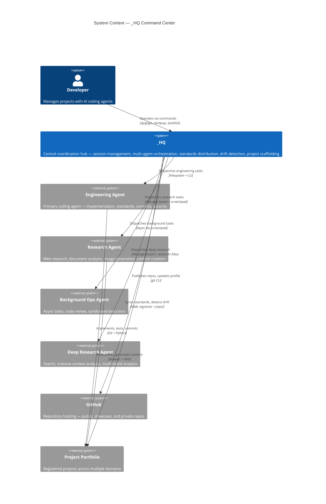
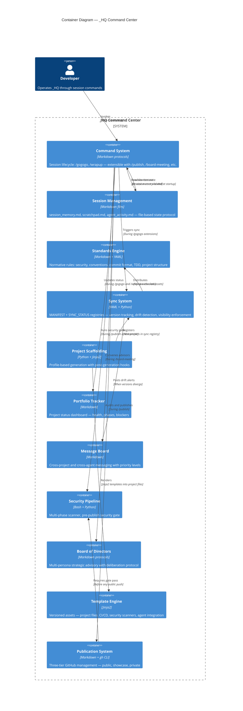
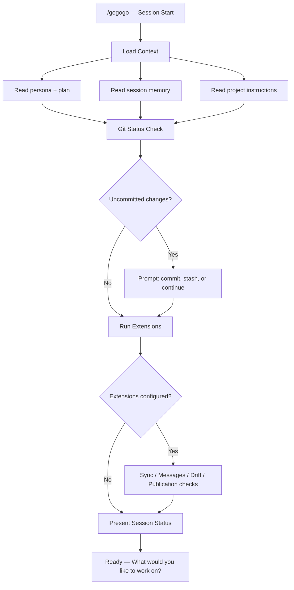
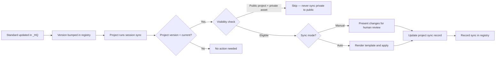
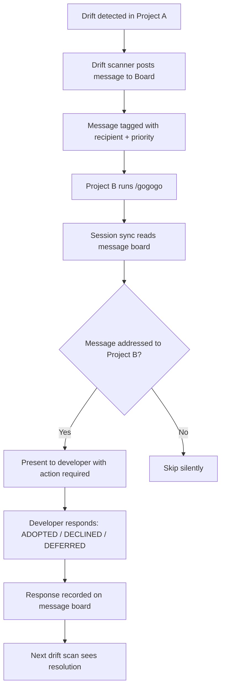
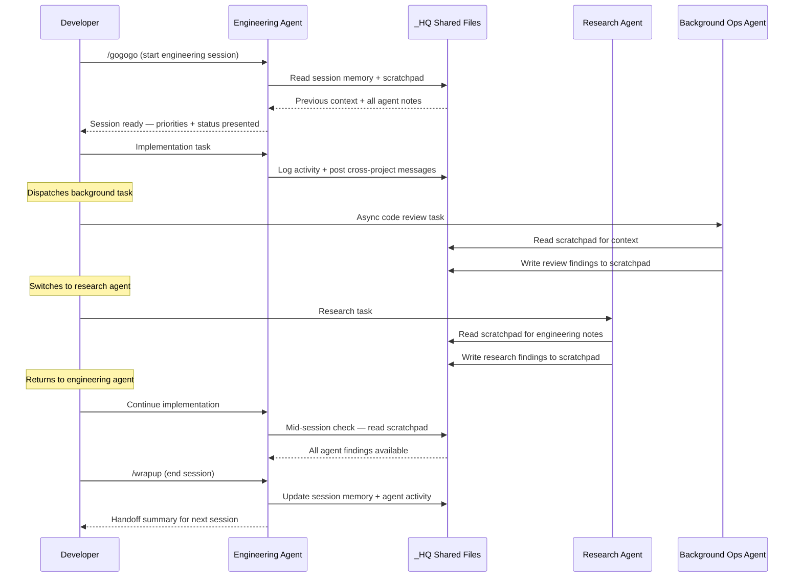

# System Architecture

> Technical architecture documentation for _HQ — AI-Augmented Project Command Center.
> Follows the [C4 Model](https://c4model.com/) with Mermaid.js diagrams.

---

## 1. System Context (C4 Level 1)

How _HQ fits into a development workflow, coordinating across projects and AI agents on different platforms.



---

## 2. Container Architecture (C4 Level 2)

The logical containers that compose _HQ. Each container is a functional subsystem implemented as files and scripts — no servers, no databases.



---

## 3. Framework Directory Structure

```
_HQ/
├── CLAUDE.md.template       <- AI agent instruction template
├── GETTING_STARTED.md       <- Setup guide
├── commands/                <- Session lifecycle protocols
│   ├── gogogo.md            <- Session startup (with extension points)
│   └── wrapup.md            <- Session close (with extension points)
├── sessions/                <- File-based state protocol
│   ├── README.md            <- Protocol documentation
│   ├── session_memory.md    <- Persistent cross-session log (gitignored)
│   ├── scratchpad.md        <- Ephemeral inter-agent notes (gitignored)
│   └── agent_activity.md    <- Agent coordination log (gitignored)
├── me/                      <- Developer context (user-created)
│   ├── persona.md           <- Background, skills, preferences
│   └── plan.md              <- Current goals and priorities
├── standards/               <- Engineering standards (Phase 2)
├── templates/               <- Jinja2 project templates (Phase 2)
├── scaffold/                <- Project generator (Phase 2)
├── guides/                  <- Best practices (Phase 3)
├── messages/                <- Cross-project communication (Phase 4)
├── portfolio/               <- Project status tracking (Phase 4)
└── ARCHITECTURE.md          <- You are here
```

---

## 4. Key Design Decisions

| Decision | Choice | Why | Alternatives Considered |
|----------|--------|-----|------------------------|
| Data storage | YAML registries + Markdown | Zero dependencies, human-readable, git-friendly, editable by AI agents | SQLite (overhead for file-based coordination), JSON (less readable) |
| Template engine | Jinja2 | Industry standard, supports conditionals and loops, Python-native | Cookiecutter (too opinionated), Copier (extra dependency), string formatting (insufficient) |
| Multi-platform agent coordination | Convention-based (shared files) | No agent has real-time file detection; polling conventions are reliable across all platforms | WebSocket notifications (over-engineered), database locks (wrong abstraction), single-platform (limits capability) |
| Standards enforcement | Version-tracked sync with drift detection | Projects evolve independently; central enforcement would be brittle | Git submodules (merge conflicts), monorepo (projects are independent), copy-paste (no tracking) |
| Security scanning | Multi-phase Bash + Python + local LLM | Catches secrets, PII, private paths, commercial markers in one pass before any publish | Pre-commit hooks only (misses non-git content), commercial tools (cost, vendor lock-in) |
| GitHub publication | Three-tier model (Public/Showcase/Private) | Maximizes portfolio visibility while protecting commercial IP | All-public (IP risk), all-private (no visibility), per-file access control (not supported) |
| Agent platform selection | Best-of-breed per task type | Each platform has distinct strengths; multi-platform approach maximizes capability coverage | Single platform (capability gaps), two platforms (misses lanes) |

---

## 5. Data Flow — Session Lifecycle

The primary operational flow when a developer starts a work session.



---

## 6. Data Flow — Standards Distribution

How engineering standards propagate from _HQ to all registered projects, with visibility enforcement.



---

## 7. Data Flow — Cross-Project Communication

How projects communicate through _HQ without requiring the developer to relay information.



---

## 8. Component Interaction — Multi-Agent Coordination

How multiple AI agents coordinate through _HQ's shared infrastructure without real-time communication.



---

## 9. Security Posture

| Concern | Approach |
|---------|----------|
| Secrets detection | Multi-phase scanner checks for API keys, tokens, passwords, .env files, private key patterns |
| PII protection | Scanner detects names, emails, phone numbers, addresses |
| Private content isolation | Visibility enforcement — private assets never sync to public projects |
| Git history hygiene | Pre-publish gate scans commit history for previously committed secrets |
| Content classification | Three-level system (public, context-only, private) controls what AI agents can read and output |
| Cross-platform security | All agents operate under the same security standards regardless of platform |

---

*This document describes the system architecture. See [GETTING_STARTED.md](GETTING_STARTED.md) for setup instructions and [README.md](README.md) for an overview.*

*Copyright 2026 TJ Neary. All Rights Reserved.*
