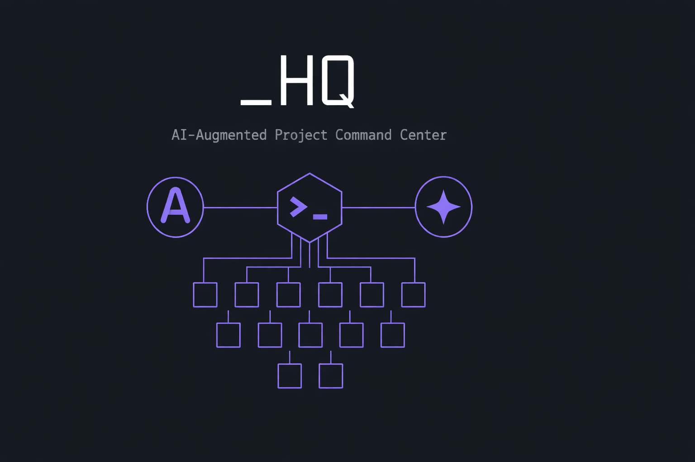

# _HQ — AI-Augmented Project Command Center

A file-based framework for managing AI coding agents across sessions and projects. Give your agents persistent memory, structured handoffs, and multi-agent coordination — without servers, databases, or platform lock-in.

**Built in production**, not in theory. This system runs daily across 14 projects, 5 AI agents from 3 competing platforms (Anthropic Claude, OpenAI Codex, Google Gemini), and 70 agent instances — all coordinating through shared markdown files, conventions, and an MCP coordination server.

**[Get Started in 15 minutes >>>](GETTING_STARTED.md)**

---

## The Problem

AI coding agents are stateless. Every session starts from zero. If you use multiple AI tools, they can't see each other's work. If you manage multiple projects, each one is an isolated silo.

Most developers compensate by manually re-explaining context, copy-pasting between tools, and keeping track of everything in their head. This works for one agent in one project. It breaks down fast with multiple agents or multiple projects.

## The Solution

_HQ solves this with three ideas:

1. **Session bookending** — `/gogogo` loads context at session start, `/wrapup` saves it at session end. Every session starts informed and ends clean.
2. **File-based state** — Agents share state through markdown files (`session_memory.md`, `scratchpad.md`, `agent_activity.md`). Any agent that can read files can participate.
3. **Convention over infrastructure** — No databases, no servers, no message queues. Just files and conventions about when to read and write them.

---

## What's Included

### Phase 1: Session Management Core (Available Now)

The foundation — how sessions start, how they end, and how state persists between them.

| Component | File | What It Does |
|-----------|------|-------------|
| **Session Startup** | `commands/gogogo.md` | Loads context, checks git status, presents priorities, runs extensions |
| **Session Close** | `commands/wrapup.md` | Commits changes, writes session notes, reviews docs, prepares handoff |
| **State Protocol** | `sessions/README.md` | Explains the three session files and conventions for reading/writing them |
| **Project Instructions** | `CLAUDE.md.template` | Template for AI agent instruction files with extension points |
| **Getting Started** | `GETTING_STARTED.md` | Step-by-step setup guide (15 minutes, no dependencies) |

### Roadmap

| Phase | What | Status |
|-------|------|--------|
| **Phase 1** | Session management, file-based state, getting started guide | Available |
| **Phase 2** | Standards, templates, project scaffolding | Planned |
| **Phase 3** | Multi-agent coordination (domain lanes, handoff protocols) | Planned |
| **Phase 4** | Cross-project sync, drift detection, portfolio management | Planned |
| **Phase 5** | Publication pipeline, advisory board, decision records | Planned |

Each phase builds on the previous one. Phase 1 is self-contained — you can use it without anything from later phases.

---

## How It Works

### Session Lifecycle

```
/gogogo                         /wrapup
   |                               |
   v                               v
Load persona + plan            Git cleanup (commit/push)
   |                               |
Check git status               Write session memory
   |                               |
Read session memory            Update plan (if changed)
   |                               |
Run extensions (optional)      Review documentation
   |                               |
Present priorities             Session summary + handoff
   |
"What should we work on?"
```

### File-Based State Protocol

Three markdown files persist across sessions:

| File | What | When Read | When Written |
|------|------|-----------|-------------|
| `session_memory.md` | What happened in past sessions | Session start | Session end |
| `scratchpad.md` | Quick handoff notes between agents | Before major tasks | Anytime |
| `agent_activity.md` | Who's active, what they're touching | Session start | Session start + end |

**No real-time sync.** Agents don't know when another agent writes something — they check when they need to. This is handled by convention:

- `/gogogo` reads all three files automatically
- Mid-session: re-read `scratchpad.md` before major tasks
- `/wrapup` writes to `session_memory.md` and `agent_activity.md`

### Context Reconstruction

Every session starts clean. The agent doesn't "remember" previous sessions — it **reconstructs** understanding from files:

1. `persona.md` — who am I working with?
2. `plan.md` — what are the current priorities?
3. `session_memory.md` — what happened recently?
4. Project's `CLAUDE.md` — what are the rules for this project?

The conversation is disposable. The files are permanent. This means any agent can pick up where any other agent left off, and switching between AI tools doesn't lose state.

---

## Quick Start

```bash
# Copy the framework files into your project
cp -r commands/ your-project/commands/
cp -r sessions/ your-project/sessions/
cp CLAUDE.md.template your-project/CLAUDE.md

# Create local session files (gitignored)
echo "# Session Memory" > your-project/sessions/session_memory.md
echo -e "# Scratchpad\n\n## Open Notes" > your-project/sessions/scratchpad.md
echo -e "# Agent Activity\n\n## Recent Activity" > your-project/sessions/agent_activity.md

# Customize CLAUDE.md with your project info, then:
# Start any AI coding session and type: /gogogo
```

See **[GETTING_STARTED.md](GETTING_STARTED.md)** for the full setup guide.

---

## Production Origin

This isn't a theoretical framework — it's extracted from a system that runs daily:

- **14 registered projects** spanning AI/ML, voice processing, knowledge management, career tools, and web crawling
- **~6,700 tests** across the portfolio, all managed through _HQ's standards distribution
- **5 AI agents across 3 platforms** (Claude, Codex CLI, Codex Extension, Gemini CLI, Gemini Sidebar) — 70 agent instances with shared awareness
- **68 versioned assets** (standards, guides, templates) distributed with drift detection
- **MCP coordination server** — 15 tools for structured multi-agent coordination via stdio transport
- **Convention-based coordination** — no agent has real-time detection, yet handoffs work reliably through file-based protocols

The phased release extracts and genericizes each layer of this system so others can adopt the parts they need.

---

## Core Capabilities (Full System)

These capabilities are available across all phases of the framework:

| Capability | Phase | What It Does |
|-----------|-------|-------------|
| **Session Continuity** | 1 | Structured startup/wrapup, persistent memory, cross-session handoff |
| **Multi-Agent Coordination** | 3 | Domain lanes, handoff protocols, conflict detection, composure management |
| **Standards Distribution** | 2 | Versioned standards with drift detection, visibility enforcement |
| **Project Scaffolding** | 2 | Profile-based generation with Jinja2 templates, auto-registration |
| **Cross-Project Communication** | 4 | Message board with priority levels, bulletin system, status dashboard |
| **Security Pipeline** | 5 | 9-phase scanner, pre-publish gate, content classification |
| **Publication Management** | 5 | Three-tier GitHub model (public/showcase/private), automated readiness |
| **Strategic Advisory Board** | 5 | Multi-persona deliberation protocol for strategic decisions |

---

## Compatibility

Works with any AI coding agent that can read and write files:

| Agent | Status | Notes |
|-------|--------|-------|
| Claude Code | Tested | Primary development platform. Reads `CLAUDE.md` automatically. |
| Cursor | Compatible | Use `.cursorrules` to reference commands |
| OpenAI Codex | Tested | Use `AGENTS.md` for instruction file |
| Gemini (sidebar) | Tested | Use `ANTIGRAVITY.md` for instruction file |
| Gemini CLI | Tested | Reads `GEMINI.md` |
| Windsurf | Compatible | Use `.windsurfrules` for instruction file |

The session files and commands are agent-agnostic. Only the instruction file convention differs.

---

## System Design

See **[ARCHITECTURE.md](ARCHITECTURE.md)** for the full C4 model with Mermaid.js diagrams covering system context, container architecture, session lifecycle, and multi-agent coordination sequences.

---

## License

Copyright 2026 TJ Neary. All Rights Reserved.

License terms are being finalized. If you're interested in using this framework, [open an inquiry](https://github.com/TJ-Neary/HQ-Command-Center/issues/new?template=inquiry.yml).
